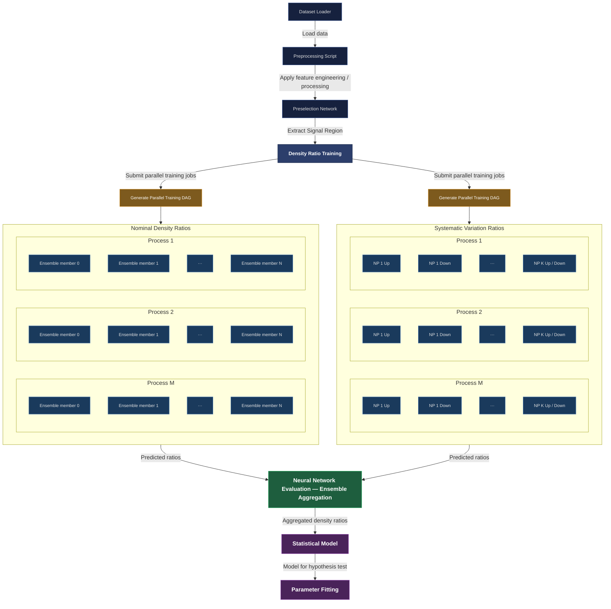

## Workflow chart

```mermaid
flowchart TD
    classDef stageLabel fill:#2c3e6b,stroke:#1a2a4a,color:#fff,font-weight:bold,font-size:14px
    classDef job fill:#16213e,stroke:#3d5a99,color:#e0e0e0,font-size:13px
    classDef parallel fill:#1a3a5c,stroke:#4a7ab5,color:#e0e0e0,font-size:12px
    classDef pre fill:#7d5a1e,stroke:#c47d0e,color:#fff,font-size:12px
    classDef eval fill:#1e5e3e,stroke:#27ae60,color:#fff,font-weight:bold
    classDef fit fill:#4a235a,stroke:#8e44ad,color:#fff,font-weight:bold

    %% ─── STAGE 1 & 2 ───
    J1["Dataset Loader"]
    J2["Preprocessing Script"]
    J1 -->|"Load data"| J2

    J3["Preselection Network"]
    J2 -->|"Apply feature engineering / processing"| J3

    %% ─── STAGE 3 ───
    DRT["Density Ratio Training"]
    J3 -->|"Extract Signal Region"| DRT

    PRE_NOM["Generate Parallel Training DAG"]
    PRE_SYS["Generate Parallel Training DAG"]

    DRT -->|"Submit parallel training jobs"| PRE_NOM
    DRT -->|"Submit parallel training jobs"| PRE_SYS

    subgraph NOMINAL["Nominal Density Ratios"]
        direction LR
        subgraph P3["Process M"]
            N1["Ensemble member 0"]
            N2["Ensemble member 1"]
            ND["···"]
            NN2["Ensemble member N"]
        end
        subgraph P2["Process 2"]
            Z1["Ensemble member 0"]
            Z2["Ensemble member 1"]
            ZD["···"]
            ZN["Ensemble member N"]
        end
        subgraph P1["Process 1"]
            T1["Ensemble member 0"]
            T2["Ensemble member 1"]
            TD["···"]
            TN["Ensemble member N"]
        end
    end

    subgraph SYSTEMATICS["Systematic Variation Ratios"]
        direction LR
        subgraph SP3["Process M"]
            SN1["NP 1 Up"]
            SN2["NP 1 Down"]
            SND["···"]
            SNN["NP K Up / Down"]
        end
        subgraph SP2["Process 2"]
            SZ1["NP 1 Up"]
            SZ2["NP 1 Down"]
            SZD["···"]
            SZN["NP K Up / Down"]
        end
        subgraph SP1["Process 1"]
            S1["NP 1 Up"]
            S2["NP 1 Down"]
            SD["···"]
            SN["NP K Up / Down"]
        end
    end

    PRE_NOM --> NOMINAL
    PRE_SYS --> SYSTEMATICS

    EVAL["Neural Network Evaluation — Ensemble Aggregation"]
    NOMINAL -->|"Predicted ratios"| EVAL
    SYSTEMATICS -->|"Predicted ratios"| EVAL

    STAT["Statistical Model"]
    EVAL -->|"Aggregated density ratios"| STAT

    FIT["Parameter Fitting"]
    STAT -->|"Model for hypothesis test"| FIT

    class J1,J2,J3 job
    class DRT stageLabel
    class T1,T2,TD,TN,Z1,Z2,ZD,ZN,N1,N2,ND,NN2 parallel
    class S1,S2,SD,SN,SZ1,SZ2,SZD,SZN,SN1,SN2,SND,SNN parallel
    class PRE_NOM,PRE_SYS pre
    class EVAL eval
    class FIT,STAT fit

```
